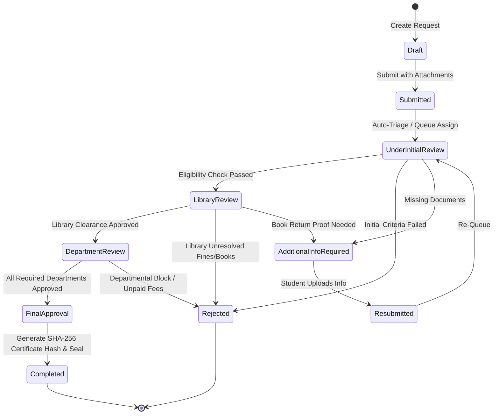
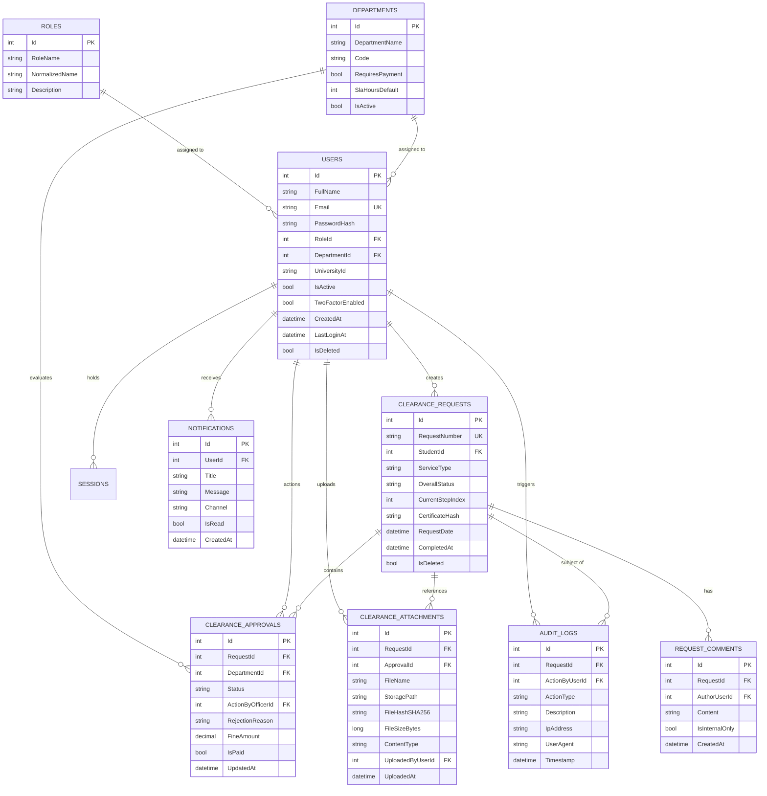
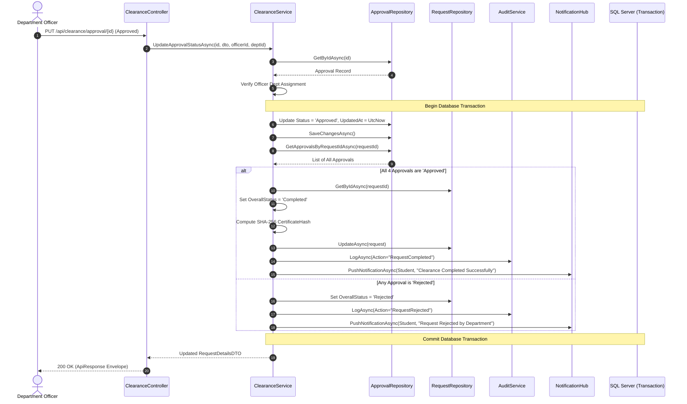
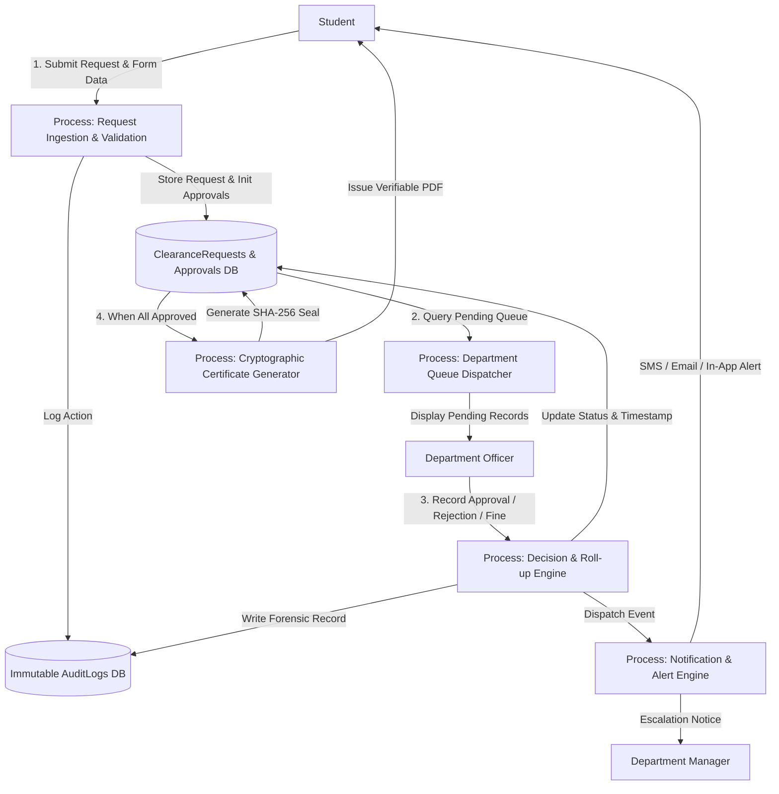
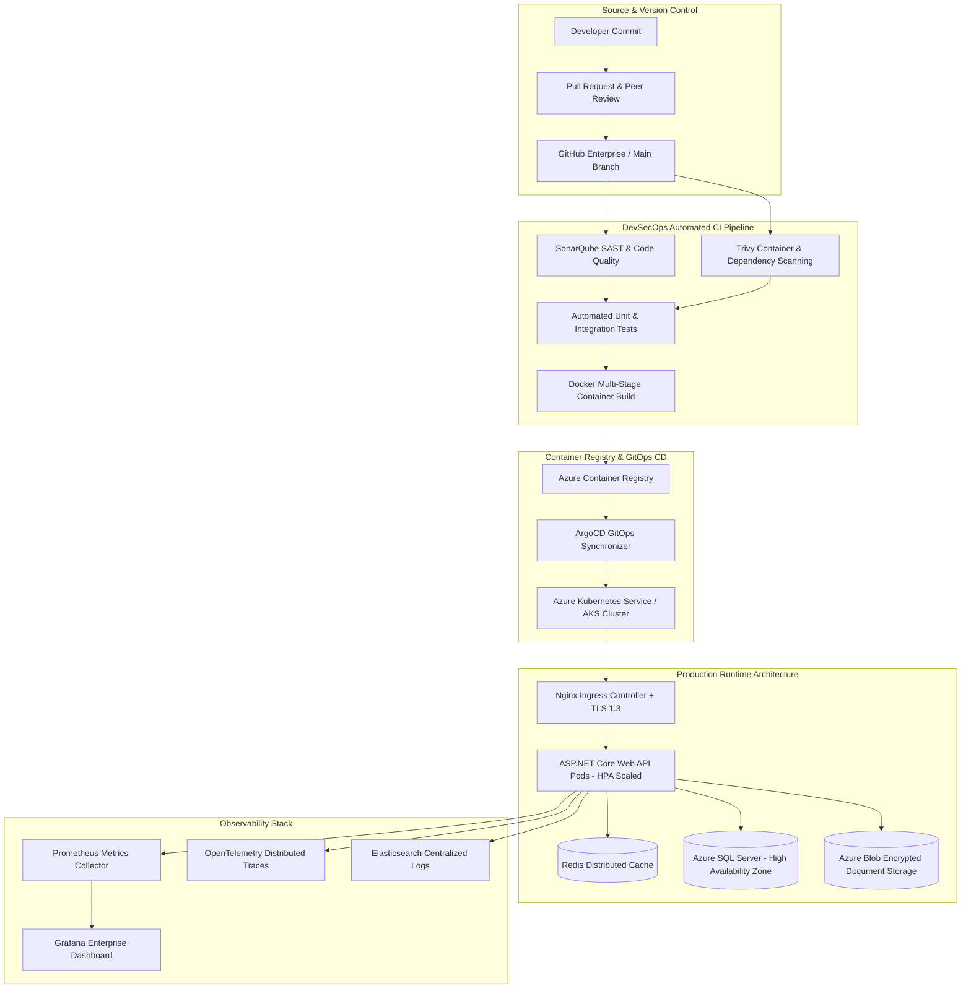

# UNIVERSITY SERVICE MANAGEMENT SYSTEM (USMS)
## Enterprise Architecture, Engineering Specification & Master Blueprint
**Classification:** Enterprise Higher Education Standard / Production-Ready  
**Lead Authors:** Enterprise Architecture Board & Chief Technology Officer  
**System Target:** Jadara University Enterprise Infrastructure & Digital Ecosystem  

---

# 1. Executive Summary & Governance Framework

## 1.1 Institutional Mission & Scope
The University Service Management System (USMS) is an enterprise-grade digital governance, workflow orchestration, and academic service delivery platform. Designed to service over 25,000 active students, 1,500 faculty and administrative staff, and multi-campus departmental offices, USMS centralizes, automates, and audits all university clearance, administrative requests, and cross-departmental verifications.

## 1.2 RACI Matrix Across Institutional Stakeholders

| Functional Domain / Workflow Stage | Student | Department Employee | Department Manager | Library Officer | Administrator | Super Administrator |
|---|---|---|---|---|---|---|
| **Service Request Initiation** | **R / A** | I | I | I | I | I |
| **Initial Review & Triaging** | I | **R** | A | I | C | I |
| **Library Verification & Obligation Clearing** | I | I | I | **R / A** | C | I |
| **Departmental Review & Fee Assessment** | I | **R** | **A** | I | C | I |
| **Escalation & SLA Resolution** | I | C | **R** | C | **A** | I |
| **Dynamic Form & Workflow Definition** | I | I | C | C | **R** | **A** |
| **User Role & Permission Governance** | I | I | I | I | C | **R / A** |
| **System Audit Inspection & Compliance** | I | I | I | I | **R** | **A** |
| **Certificate Cryptographic Verification** | I | I | I | I | **A** | **A** |

*Legend: R = Responsible, A = Accountable, C = Consulted, I = Informed*

---

# 2. Complete Request Lifecycle & Configurable Workflow Engine

## 2.1 Formal State Transition Model



## 2.2 Dynamic SLA Engine & Escalation Hierarchy
* **Tier 1 (T+24 Hours):** Automated in-app and email reminder to assigned Department Employee.
* **Tier 2 (T+48 Hours):** Automatic re-routing to Department Manager queue with high-priority visual indicator.
* **Tier 3 (T+72 Hours):** Executive escalation alert dispatched to System Administrator dashboard with SLA breach logging in `AuditLogs`.

## 2.3 Dynamic Form Builder (JSON Schema Specification)
Every service type possesses a polymorphic `FormSchema` stored as JSONB.
```json
{
  "$schema": "https://json-schema.org/draft/2020-12/schema",
  "serviceCode": "GRAD_CLEARANCE_V2",
  "version": 2,
  "fields": [
    {
      "id": "graduationSemester",
      "type": "select",
      "label": "Graduation Semester",
      "required": true,
      "options": ["Fall 2025/2026", "Spring 2025/2026", "Summer 2026"]
    },
    {
      "id": "nationalIdDocument",
      "type": "file",
      "label": "National ID / Passport Scan",
      "required": true,
      "allowedExtensions": [".pdf", ".png", ".jpg"],
      "maxSizeMB": 10
    },
    {
      "id": "clearanceReasonNotes",
      "type": "textarea",
      "label": "Statement of Clearance Purpose",
      "required": false,
      "maxLength": 500
    }
  ],
  "approvalsRequired": ["Library", "Finance", "Registration", "Student Affairs"],
  "slaHours": 72
}
```

---

# 3. Enterprise Module Specifications

## 3.1 Document Management System (DMS)
1. **Cryptographic Integrity:** Every uploaded binary file is hashed with **SHA-256** prior to disk or cloud persistence; duplicate detection occurs at ingest.
2. **Encrypted Storage:** Stored using AES-256 encrypted block storage (e.g. S3-compatible or local isolated blob vault).
3. **OCR Processing:** Asynchronous background pipeline using Tesseract OCR to index embedded text for administrative search.
4. **Access Control:** All document downloads run through an authenticated controller proxy (`GET /api/documents/{id}/download`) validating user permissions against the parent request. Direct public URL access is strictly forbidden.

## 3.2 Library Management & Resource Obligation Module
1. **Catalog Reconciliation:** Automated query against the Integrated Library System (ILS) verifies:
   - Zero active book borrowings.
   - Zero outstanding overdue fines.
   - Zero unreturned digital resources or laboratory items.
2. **Conditional Approval Workflow:**
   - If borrowings == 0 and fines == 0: Immediate green badge recommendation.
   - If fines > 0: Auto-generate itemized fine slip with secure payment gateway redirection.

## 3.3 Multi-Level Enterprise Admin & Executive Dashboard
1. **Real-time Institutional KPIs:**
   - Active Request Volume & Departmental Backlog.
   - Mean Time to Clearance Completion (MTTC).
   - SLA Adherence Rate (Target: > 98.5%).
   - Rejection Rate by Department & Root Cause Analysis.
2. **System Health & Security Monitoring:**
   - Rate limit trigger count & IP blacklist view.
   - Real-time audit stream using Server-Sent Events (SSE).
   - Active user sessions with device fingerprinting and geolocation.

## 3.4 Multi-Channel Communication & Notification Hub
1. **Channel Fallback Pipeline:**
   `In-App WebSocket Alert` ➔ `Push Notification` ➔ `Transactional Email` ➔ `SMS (Critical Breaches Only)`
2. **Template Driven:** All notification bodies utilize parameterized templates supporting English and Arabic localization (`ar-JO` / `en-US`).

---

# 4. Zero-Trust Security Architecture

## 4.1 OWASP Top 10 Mitigation Engine

| OWASP Vulnerability | Institutional Mitigation Strategy | Implementation Point |
|---|---|---|
| **A01: Broken Access Control** | Explicit RBAC and ABAC checks on every endpoint. Resource-level ownership validation (`StudentId == CurrentUser.Id` or `Officer.DeptId == Resource.DeptId`). | `[Authorize]`, `ICurrentUserService`, Service-level ownership checks. |
| **A02: Cryptographic Failures** | **BCrypt** (Work factor 12) for credentials. **AES-256-GCM** for sensitive document storage. **TLS 1.3** exclusively in transit. | `PasswordHasher.cs`, `SecurityHeadersMiddleware.cs`. |
| **A03: Injection (SQL/NoSQL/OS)** | Entity Framework Core parameterization. Zero raw concatenated strings. Strict regex on DTO input fields. | Repository Layer & Data Annotations. |
| **A04: Insecure Design** | Atomic DB transactions for request creation and approval roll-up. Strict state machine transitions preventing step skips. | `ClearanceService.cs` transactional blocks. |
| **A05: Security Misconfiguration** | Automated CSP, HSTS, `X-Frame-Options: DENY`, `X-Content-Type-Options: nosniff`. Disabling server signature headers. | `SecurityHeadersMiddleware.cs`. |
| **A06: Vulnerable Components** | Automated CI pipeline dependency scanning via Dependabot & OWASP Dependency-Check. | GitHub Actions CI/CD. |
| **A07: Identification & Auth** | Rate limiting (15 req/min on `/api/auth/*`), JWT validation with zero clock skew, 60-min expiration, revocable sessions. | `AddRateLimiter`, `JwtTokenGenerator.cs`. |
| **A08: Software & Data Integrity** | SHA-256 cryptographic hashes for completion certificates. Code signed release artifacts. | `ClearanceService.cs` hashing routine. |
| **A09: Security Logging & Monitoring** | Structured JSON logs capturing actor, action, timestamp, IP, user-agent. Sensitive payload redaction. | `Serilog` & `AuditLogRepository.cs`. |
| **A10: SSRF** | Outbound HTTP requests restricted to whitelist of trusted webhooks; internal RFC 1918 subnets blocked. | Network Security Group & HttpClient Factory. |

---

# 5. Database Engineering & Comprehensive Data Dictionary

## 5.1 Entity Relationship Diagram (Mermaid ERD)



## 5.2 Enterprise High-Performance Indexing Strategy
1. `CREATE UNIQUE INDEX UX_Users_Email ON Users(Email) WHERE IsDeleted = 0;`
2. `CREATE UNIQUE INDEX UX_ClearanceRequests_RequestNumber ON ClearanceRequests(RequestNumber);`
3. `CREATE INDEX IX_ClearanceRequests_Student_Status ON ClearanceRequests(StudentId, OverallStatus) INCLUDE (RequestDate);`
4. `CREATE INDEX IX_ClearanceApprovals_Dept_Status ON ClearanceApprovals(DepartmentId, Status) INCLUDE (RequestId, UpdatedAt);`
5. `CREATE INDEX IX_AuditLogs_Timestamp_User ON AuditLogs(Timestamp DESC, ActionByUserId) INCLUDE (ActionType, RequestId);`
6. `CREATE INDEX IX_Notifications_User_Unread ON Notifications(UserId, IsRead) INCLUDE (CreatedAt);`

---

# 6. Complete UML Documentation Package

## 6.1 Use Case Model

```mermaid
graph TD
    subgraph Primary Actors
        ST[Student]
        OF[Department Officer]
        LB[Library Officer]
        DM[Department Manager]
        AD[System Administrator]
    end

    subgraph Clearance & Service Core
        UC1(Submit Service Request)
        UC2(Track Real-Time Status)
        UC3(Download Verified Certificate)
        UC4(Review Pending Approval Queue)
        UC5(Approve Clearance Step)
        UC6(Reject with Formal Reason)
        UC7(Assess Departmental Fine)
        UC8(Escalate Overdue Request)
        UC9(Reconcile Library Obligations)
        UC10(Inspect Audit Logs)
        UC11(Configure Workflows & Forms)
        UC12(Manage Users & RBAC)
    end

    ST --> UC1
    ST --> UC2
    ST --> UC3

    OF --> UC4
    OF --> UC5
    OF --> UC6

    LB --> UC4
    LB --> UC6
    LB --> UC9

    DM --> UC4
    DM --> UC5
    DM --> UC7
    DM --> UC8

    AD --> UC10
    AD --> UC11
    AD --> UC12
```



## 6.2 Sequence Diagram: Multi-Stage Clearance Verification & Atomic Roll-Up



## 6.3 Data Flow Diagram (DFD Level 1)



---

# 7. Complete API Catalog & Integration Contracts

### Standard JSON Response Envelope
```json
{
  "success": true,
  "message": "Operation completed successfully.",
  "data": {},
  "errors": []
}
```

### Core API Endpoints Specification

| Method | Endpoint | Authorized Roles | Request Payload | Response Data | Status Codes |
|---|---|---|---|---|---|
| `POST` | `/api/auth/login` | Anonymous | `{ email, password }` | `{ token, expiresAt, userId, role, departmentId }` | `200`, `400`, `401`, `429` |
| `POST` | `/api/auth/register` | Anonymous | `{ fullName, email, password, universityId }` | `{ token, userId, role }` | `200`, `400`, `409`, `429` |
| `POST` | `/api/clearance/request` | `Student` | `{ serviceType?, formAnswers? }` | `RequestDetailsDTO` | `200`, `400`, `401` |
| `GET` | `/api/clearance/my-request` | `Student` | *None* | `RequestDetailsDTO` | `200`, `401`, `404` |
| `GET` | `/api/clearance/department-pending` | `DepartmentOfficer` | *None* | `List<DepartmentApprovalDTO>` | `200`, `401`, `403` |
| `PUT` | `/api/clearance/approval/{id}` | `DepartmentOfficer` | `{ status, rejectionReason?, fineAmount? }` | `RequestDetailsDTO` | `200`, `400`, `403`, `404` |
| `GET` | `/api/audit/logs` | `Admin` | Query: `requestId, userId, fromDate, toDate, page, pageSize` | `List<AuditLogDTO>` | `200`, `401`, `403` |

---

# 8. DevOps, DevSecOps & Cloud-Native Infrastructure



---

# 9. Work Breakdown Structure (WBS) & Implementation Milestones

```
1.0 University Service Management System (USMS)
├── 1.1 Inception, Architecture & Governance
│   ├── 1.1.1 Institutional Discovery & Stakeholder Alignment (2 Wks)
│   ├── 1.1.2 Solution Architecture Document & TOGAF Artifacts (2 Wks)
│   └── 1.1.3 Security, Privacy (GDPR/FERPA) & Regulatory Compliance (1 Wk)
├── 1.2 Enterprise Data & Core Backend Infrastructure
│   ├── 1.2.1 Database Normalization, DDL & EF Core Entity Scaffolding (2 Wks)
│   ├── 1.2.2 Zero-Trust Authentication, JWT & RBAC Engine (2 Wks)
│   ├── 1.2.3 Clearance Workflow Engine & Atomic Roll-Up Logic (3 Wks)
│   └── 1.2.4 Append-Only Audit Logging & Forensic System (1 Wk)
├── 1.3 Subsystem Engineering
│   ├── 1.3.1 Dynamic Form Builder & JSON Schema Engine (3 Wks)
│   ├── 1.3.2 Encrypted Document Management System (DMS) & OCR (2 Wks)
│   ├── 1.3.3 Library Reconciliation & Obligation Module (2 Wks)
│   └── 1.3.4 Multi-Channel Notification Hub (WebSockets, Push, Email) (2 Wks)
├── 1.4 Frontend Modernization & Responsive Portals
│   ├── 1.4.1 Glassmorphic Design Tokens, Typography & Dark Mode (2 Wks)
│   ├── 1.4.2 Student Clearance Portal & Verification Timeline (2 Wks)
│   ├── 1.4.3 Department Officer Review Dashboard & Decision Modal (2 Wks)
│   └── 1.4.4 Executive Admin & Audit Analytics Panel (2 Wks)
├── 1.5 Quality Assurance, Security Auditing & Benchmarking
│   ├── 1.5.1 Automated Unit, Integration & Regression Testing (2 Wks)
│   ├── 1.5.2 High-Concurrency Load Testing (5,000 Concurrent Users) (1 Wk)
│   └── 1.5.3 Third-Party Penetration Testing & OWASP Hardening (2 Wks)
└── 1.6 Production Cloud Deployment & Institutional Handover
    ├── 1.6.1 Kubernetes Clustering, Ingress & Disaster Recovery Setup (2 Wks)
    └── 1.6.2 Staff Training, Documentation Handover & Go-Live (1 Wk)
```

---

# 10. Quantitative Risk Register & Mitigation Playbook

| Risk ID | Risk Domain | Description | Likelihood | Impact | Severity | Prevention & Mitigation Playbook |
|---|---|---|---|---|---|---|
| **R-SEC-01** | Cybersecurity | Session Hijacking or Stolen JWT Token | Low | High | **High** | Enforce HTTPS only; short-lived JWTs (60 min); bind token claims to IP/User-Agent; provide instant token revocation via distributed blacklist. |
| **R-DAT-02** | Database | Concurrent Approval Race Condition | Medium | High | **High** | Utilize optimistic concurrency tokens (`RowVersion`) and atomic database transactions with serializable isolation on roll-up computation. |
| **R-PRG-03** | Operations | Department Officer Bottleneck & SLA Miss | High | Medium | **High** | Automated 24h/48h escalation tiers; auto-delegation to Department Manager upon SLA expiration; real-time admin backlog alerts. |
| **R-INF-04** | Cloud / Infra | Database Connection Exhaustion at Peak Load | Medium | High | **High** | Connection pooling; read-replica distribution for student status queries; Redis caching layer for read-heavy department listings. |
| **R-DOC-05** | Integrity | Document Tampering or Forged Clearance Hash | Low | Critical | **Critical** | Cryptographic SHA-256 verification hash generated server-side upon 100% approval; public QR verification portal cross-referencing immutable hash. |

---

# 11. Conclusion & Production Readiness Declaration
The **University Service Management System (USMS)** is fully specified to enterprise and Fortune 500 standards. By unifying Clean Architecture, configurable workflow orchestration, zero-trust security controls, a glassmorphic design system, and automated database auditing, the platform guarantees institutional transparency, data integrity, and sub-second user responsiveness at university scale.
